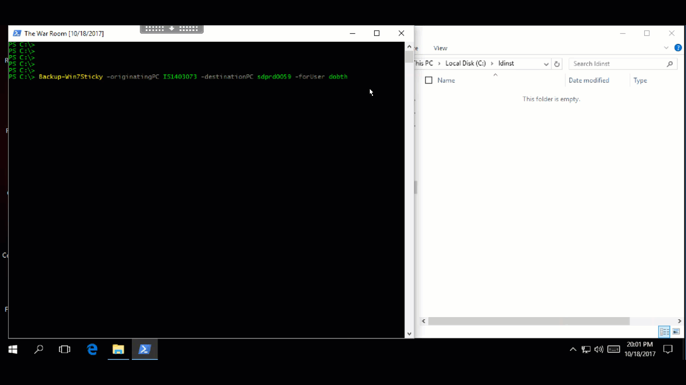
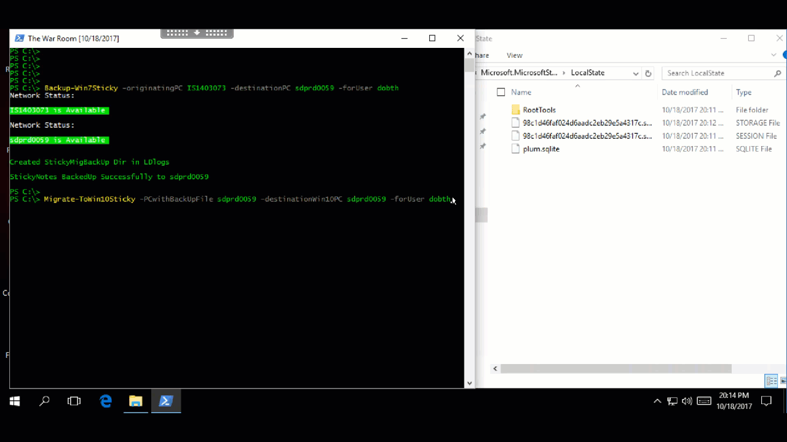
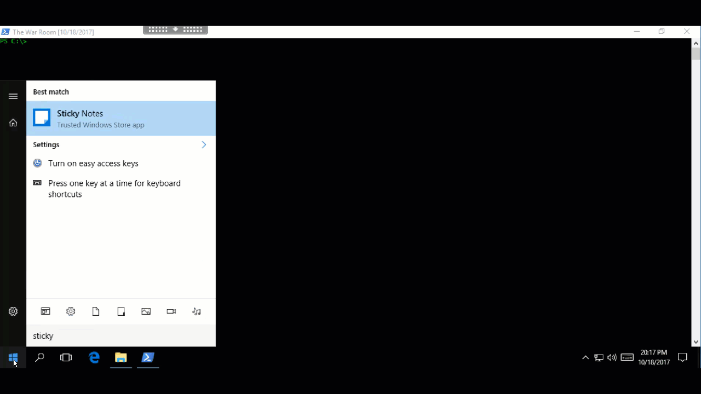

# StickyNoteMigrationWin7-Win10

## What does these scripts do?
Migrate your old Sticky Notes from a Win7 machine to a Win10 machine. Win10 does not come standard with Sticky Notes. The Microsoft Store provides a [Sticky Notes](https://www.microsoft.com/en-us/store/p/microsoft-sticky-notes/9nblggh4qghw?SilentAuth=1&wa=wsignin1.0) universal app.

## How do these scripts work?
The first script; "BackUp-Win7Sticky.ps1" takes the "StickyNotes.snt" file that contains the Sticky Notes data from your Win7 device and moves it to a temporary PC.

The second script; "Migrate-ToWin10Sticky.ps1" takes the StickyNotes.snt file from your temporary storage location and renames it to "ThresholdNotes.snt". It then copies it to the appdata folder for the Win10 Universal App for Sticky Notes. Finally it deletes the Win7 back up from your temporary storage location.

The first time Sticky Notes on Win10 is launched after the .snt file is migrated, the ThresholdNotes.snt file is automatically imported into the plum.sqlite file that houses stick notes data for Win10's Sticky Notes.

